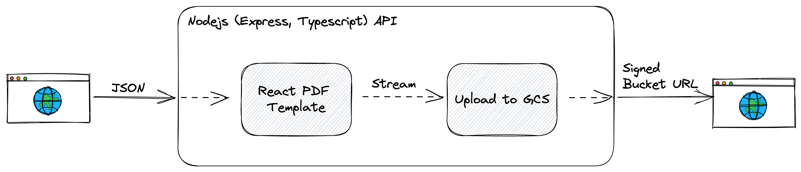
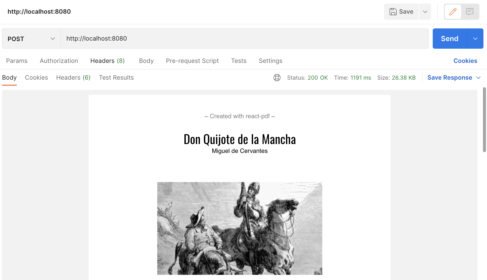

[React Components to PDF API with CloudRun and Terraform](https://www.mharrvic.com/notes/react-components-to-pdf-with-cloudrun-and-terraform)

# Architecture



# Techstack to use

- Express.js
- Typescript
- Google Cloud Storage
- react-pdf/renderer

# Requirements

- NPM CLI - [https://docs.npmjs.com/downloading-and-installing-node-js-and-npm](https://docs.npmjs.com/downloading-and-installing-node-js-and-npm)
- Terraform CLI - [https://developer.hashicorp.com/terraform/cli/commands](https://developer.hashicorp.com/terraform/cli/commands)
  - If you are using M1 mac and having a trouble setting up, you can follow this GIST [https://gist.github.com/mharrvic/12b46934c608b0e21d6dd3e9fdeb1669](https://gist.github.com/mharrvic/12b46934c608b0e21d6dd3e9fdeb1669)
- GCLOUD CLI - [https://cloud.google.com/sdk/gcloud](https://cloud.google.com/sdk/gcloud)

# Express.js API Setup

You can skip this step and just use some templates available [https://github.com/topics/express-typescript](https://github.com/topics/express-typescript)

If you'd like to proceed with the manual setup, let's do it!

Initialize the package.json file, open terminal

```bash
# Create a new folder
mkdir pdf-service

# Change the directory to our newly created folder
cd pdf-service

# Create package.json file
npm init --y
```

Install packages

```bash
# Install Dependencies
npm install express dotenv esbuild ulid rimraf

# Install DevDependencies
npm install -D @types/express @types/node typescript ts-node nodemon
```

Create a `tsconfig.json` in the root folder, and add this

```json
{
  "compilerOptions": {
    "jsx": "react",
    "rootDir": "./src",
    "outDir": "./build",
    "target": "es6" /* Set the JavaScript language version for emitted JavaScript and include compatible library declarations. */,
    "module": "commonjs" /* Specify what module code is generated. */,
    "esModuleInterop": true /* Emit additional JavaScript to ease support for importing CommonJS modules. This enables 'allowSyntheticDefaultImports' for type compatibility. */,
    "forceConsistentCasingInFileNames": true /* Ensure that casing is correct in imports. */,
    "strict": true /* Enable all strict type-checking options. */,
    "skipLibCheck": true /* Skip type checking all .d.ts files. */
  }
}
```

Create a new `src` folder, then add an `app.ts` file inside it.

```ts
import * as dotenv from "dotenv";
import express from "express";

dotenv.config();

const app = express();
app.use(express.json());

app.get("/health-check", async (req, res) => {
  res.status(200).send({ message: "PDF Generator Service" });
});

app.post("/", async (req, res) => {
  try {
    res.status(200).send({
      message: "PDF Generator Service",
      url: "test",
    });
  } catch (error) {
    res.status(500).send(error);
  }
});

export { app };
```

Create an `index.ts` file inside the `src` folder

```ts
import { app } from "./app";

const PORT = process.env.PORT || 8080;

/**
 * Initialize app and start Express server
 */
const main = async () => {
  // Start server listening on PORT env var
  app.listen(PORT, () => console.log(`Listening on port ${PORT}`));
};

main();
```

The current folder structure should look like this

```bash
├── node_modules/
├── package-lock.json
├── package.json
├── src
│   ├── app.ts
│   └── index.ts
└── tsconfig.json
```

Let’s add `dev` , `serve:build`, and `build` command
Open `package.json` file and add these inside the `scripts`

```json
"dev": "NODE_ENV=development ./node_modules/.bin/nodemon --exec './node_modules/.bin/ts-node' src/index.ts",
"serve:build": "cd build && node index.js",
"build": "rimraf build && esbuild src/index.ts --platform=node  --bundle --minify --outfile=build/index.js"
```

Let’s try the dev command if it works

```bash
npm run dev

# The output should be like this
[nodemon] 2.0.20
[nodemon] to restart at any time, enter `rs`
[nodemon] watching path(s): *.*
[nodemon] watching extensions: ts,json
[nodemon] starting `./node_modules/.bin/ts-node src/index.ts`
Listening on port 8080
```

Open the browser with [http://localhost:8080/health-check](http://127.0.0.1:8080/health-check), and the output should be like this

```bash
{"message":"PDF Generator Service"}
```

Commit: [https://github.com/mharrvic/pdf-generator-service-template/commit/bf665b3f834413a95fde548bae716dff52d5490f](https://github.com/mharrvic/pdf-generator-service-template/commit/bf665b3f834413a95fde548bae716dff52d5490f)

# React-PDF Template

Let’s now setup our API with react-pdf template

Install react-pdf/renderer package

```bash
npm install @react-pdf/renderer react@latest react-dom@latest --legacy-peer-deps

npm install -D @types/react @types/react-dom --legacy-peer-deps
```

Create a new `template` folder under `src`, then add a `pdf-template.tsx` file inside it.

```tsx
// Contents from https://react-pdf.org/repl

import ReactPDF, {
  Document,
  Font,
  Image,
  Page,
  StyleSheet,
  Text,
} from "@react-pdf/renderer";

import React from "react";

Font.register({
  family: "Oswald",
  src: "https://fonts.gstatic.com/s/oswald/v13/Y_TKV6o8WovbUd3m_X9aAA.ttf",
});

const styles = StyleSheet.create({
  body: {
    paddingTop: 35,
    paddingBottom: 65,
    paddingHorizontal: 35,
  },
  title: {
    fontSize: 24,
    textAlign: "center",
    fontFamily: "Oswald",
  },
  author: {
    fontSize: 12,
    textAlign: "center",
    marginBottom: 40,
  },
  subtitle: {
    fontSize: 18,
    margin: 12,
    fontFamily: "Oswald",
  },
  text: {
    margin: 12,
    fontSize: 14,
    textAlign: "justify",
    fontFamily: "Times-Roman",
  },
  image: {
    marginVertical: 15,
    marginHorizontal: 100,
  },
  header: {
    fontSize: 12,
    marginBottom: 20,
    textAlign: "center",
    color: "grey",
  },
  pageNumber: {
    position: "absolute",
    fontSize: 12,
    bottom: 30,
    left: 0,
    right: 0,
    textAlign: "center",
    color: "grey",
  },
});

export const Quixote = () => (
  <Document>
    <Page style={styles.body}>
      <Text style={styles.header} fixed>
        ~ Created with react-pdf ~
      </Text>
      <Text style={styles.title}>Don Quijote de la Mancha</Text>
      <Text style={styles.author}>Miguel de Cervantes</Text>
      <Image
        style={styles.image}
        src="https://cdn.britannica.com/12/154812-050-D4E47005/Don-Quixote-Sancho-Panza-illustration-Miguel-de.jpg?w=300&h=169&c=crop"
      />
      <Text style={styles.subtitle}>
        Capítulo I: Que trata de la condición y ejercicio del famoso hidalgo D.
        Quijote de la Mancha
      </Text>
      <Text style={styles.text}>
        En un lugar de la Mancha, de cuyo nombre no quiero acordarme, no ha...
      </Text>
      <Text style={styles.text}>
        Es, pues, de saber, que este sobredicho hidalgo...
      </Text>
      <Text style={styles.text}>
        Con estas y semejantes razones perdía el pobre caballero el...
      </Text>
      <Text style={styles.text}>
        En resolución, él se enfrascó tanto en su lectura...
      </Text>
      <Text style={styles.subtitle} break>
        Capítulo II: Que trata de la primera salida que de su tierra hizo el
        ingenioso Don Quijote
      </Text>
      <Image
        style={styles.image}
        src="https://cdn.britannica.com/12/154812-050-D4E47005/Don-Quixote-Sancho-Panza-illustration-Miguel-de.jpg?w=300&h=169&c=crop"
      />
      <Text style={styles.text}>Hechas, pues, estas prevenciones...</Text>
      <Text style={styles.text}>
        Yendo, pues, caminando nuestro flamante aventurero...
      </Text>
      <Text style={styles.text}>Y era la verdad que por él caminaba...</Text>
      <Text style={styles.text}>Luego volvía diciendo...</Text>
      <Text style={styles.text}>
        Casi todo aquel día caminó sin acontecerle cosa que de contar fuese...
      </Text>
      <Text
        style={styles.pageNumber}
        render={({ pageNumber, totalPages }) => `${pageNumber} / ${totalPages}`}
        fixed
      />
    </Page>
  </Document>
);

export const pdfTemplate = async () => {
  return await ReactPDF.renderToStream(<Quixote />);
};
```

Back to our `app.ts` , let’s import the `pdfTemplate` and temporarily comment out the response with NodeJS.ReadableStream Pipe

```ts

import { pdfTemplate } from "./template/pdf-template";

....

app.post("/", async (req, res) => {
  try {
    const pdfStream = await pdfTemplate();
    res.setHeader("Content-Type", "application/pdf");
    pdfStream.pipe(res);
    pdfStream.on("end", () => console.log("Done streaming, response sent."));

    // res.status(200).send({
    //   message: "PDF Generator Service",
    //   url: "test",
    // });
  } catch (error) {
    res.status(500).send(error);
  }
});
```

Open your [Postman](https://www.postman.com/)/[Insomnia](https://insomnia.rest/)/[hoppscotch](https://hoppscotch.io/) or any API Client and make a `POST` request to [`http://localhost:8080`](http://localhost:8080/), the response should be in PDF like this



Or you can just create another `GET` test endpoint and directly access it to the browser

```ts
app.get("/test", async (req, res) => {
  try {
    const pdfStream = await pdfTemplate();
    res.setHeader("Content-Type", "application/pdf");
    pdfStream.pipe(res);
    pdfStream.on("end", () => console.log("Done streaming, response sent."));
  } catch (error) {
    res.status(500).send(error);
  }
});

// Open it in the browser http://localhost:8080/test
```

# UI Template Preview

We can now access the PDF with our test endpoint. However, debugging with react-pdf might be difficult. A UI previewer could be useful.

Let’s use [Vite](https://vitejs.dev/) for this use case

```bash
npm install -D vite @vitejs/plugin-react @esbuild-plugins/node-globals-polyfill @esbuild-plugins/node-modules-polyfill --legacy-peer-deps
```

Create a new `client-preview` folder under `src`, then add an `App.tsx` and `index.tsx` file inside it.

```tsx
// App.tsx

import React from "react";

import { PDFViewer } from "@react-pdf/renderer";
import { Quixote } from "../template/pdf-template";

function App() {
  return (
    <PDFViewer height={800} width={1000}>
      <Quixote />
    </PDFViewer>
  );
}

export default App;
```

```tsx
// index.tsx

import React from "react";

import ReactDOM from "react-dom/client";
import App from "./App";

ReactDOM.createRoot(document.getElementById("root") as HTMLElement).render(
  <App />
);
```

Create `vite.config.ts` in our root folder

```bash
import react from "@vitejs/plugin-react";
import { defineConfig } from "vite";

// You don't need to add this to deps, it's included by @esbuild-plugins/node-modules-polyfill

export default defineConfig({
  plugins: [react()],
  server: {
    port: 3001,
  },
  resolve: {
    alias: {
      // This Rollup aliases are extracted from @esbuild-plugins/node-modules-polyfill,
      // see https://github.com/remorses/esbuild-plugins/blob/master/node-modules-polyfill/src/polyfills.ts
      // process and buffer are excluded because already managed
      // by node-globals-polyfill
      util: "rollup-plugin-node-polyfills/polyfills/util",
      sys: "util",
      events: "rollup-plugin-node-polyfills/polyfills/events",
      stream: "rollup-plugin-node-polyfills/polyfills/stream",
      path: "rollup-plugin-node-polyfills/polyfills/path",
      querystring: "rollup-plugin-node-polyfills/polyfills/qs",
      punycode: "rollup-plugin-node-polyfills/polyfills/punycode",
      url: "rollup-plugin-node-polyfills/polyfills/url",
      string_decoder: "rollup-plugin-node-polyfills/polyfills/string-decoder",
      buffer: "rollup-plugin-node-polyfills/polyfills/buffer-es6",
      process: "rollup-plugin-node-polyfills/polyfills/process-es6",
      http: "rollup-plugin-node-polyfills/polyfills/http",
      https: "rollup-plugin-node-polyfills/polyfills/http",
      os: "rollup-plugin-node-polyfills/polyfills/os",
      assert: "rollup-plugin-node-polyfills/polyfills/assert",
      constants: "rollup-plugin-node-polyfills/polyfills/constants",
      _stream_duplex:
        "rollup-plugin-node-polyfills/polyfills/readable-stream/duplex",
      _stream_passthrough:
        "rollup-plugin-node-polyfills/polyfills/readable-stream/passthrough",
      _stream_readable:
        "rollup-plugin-node-polyfills/polyfills/readable-stream/readable",
      _stream_writable:
        "rollup-plugin-node-polyfills/polyfills/readable-stream/writable",
      _stream_transform:
        "rollup-plugin-node-polyfills/polyfills/readable-stream/transform",
      timers: "rollup-plugin-node-polyfills/polyfills/timers",
      console: "rollup-plugin-node-polyfills/polyfills/console",
      vm: "rollup-plugin-node-polyfills/polyfills/vm",
      zlib: "rollup-plugin-node-polyfills/polyfills/zlib",
      tty: "rollup-plugin-node-polyfills/polyfills/tty",
      domain: "rollup-plugin-node-polyfills/polyfills/domain",
    },
  },
});
```

Create `index.html` in our root folder

```html
<!DOCTYPE html>
<html lang="en">
  <head>
    <meta charset="UTF-8" />
    <link rel="icon" type="image/svg+xml" href="/vite.svg" />
    <meta name="viewport" content="width=device-width, initial-scale=1.0" />
    <title>React PDF Service</title>
  </head>
  <body>
    <div id="root"></div>
    <script type="module" src="./src/client-preview/index.tsx"></script>
  </body>
</html>
```

Open the `package.json` and add `"preview": "vite",` inside `scripts`

```json
...
"scripts": {
    "preview": "vite",
    "dev": "NODE_ENV=development ./node_modules/.bin/nodemon --exec './node_modules/.bin/ts-node' src/index.ts",
    "serve:build": "cd build && node index.js",
    "build": "rimraf build && esbuild src/index.ts --platform=node  --bundle --minify --outfile=build/index.js"
  },
...
```

Run `npm run preview`, then open the URL in your browser. You should now be able to preview your PDF!

# Upload Stream to GCS

Let’s create a utility that uploads the pdf stream to GCS

Install the cloud storage package (we are using `--legacy-peer-deps` here because we used the latest version of React and React-DOM. However, the current peer-deps of React-PDF is using the old version of React. Don't worry, we know what we're doing, so it's okay to put it there!)

```bash
npm install @google-cloud/storage --legacy-peer-deps
```

Create a new `utils` folder under `src`, then add `uploadStreamToGcs.ts`

```ts
import { Storage } from "@google-cloud/storage";
import { ulid } from "ulid";
import { format } from "util";

const storage = new Storage();

const bucketName =
  process.env.GCS_BUCKET || "any-bucket-name-may-multo-sa-likod-mo-huhu";

const storageBucket = storage.bucket(bucketName);

export const uploadStreamToGcs = async (data: NodeJS.ReadableStream) => {
  try {
    return new Promise((resolve, reject) => {
      const blob = storageBucket.file(`${ulid()}/test.pdf`);

      const blobStream = data.pipe(
        blob.createWriteStream({
          resumable: false,
        })
      );

      blobStream
        .on("finish", () => {
          const url = format(`gs://${storageBucket.name}/${blob.name}`);
          resolve(url);
        })
        .on("error", (error) => {
          reject(error);
        });
    });
  } catch (error) {
    throw new Error("Error uploading to GCS");
  }
};
```

Let’s modify our `app.ts` and use the upload to stream util to our POST endpoint

```ts
...
import { uploadStreamToGcs } from "./utils/uploadStreamToGcs";

...
app.post("/", async (req, res) => {
  try {
    // Feel free to use this body variable to pass data to your template
    const body = req.body;

    const pdfStream = await pdfTemplate();
    const url = await uploadStreamToGcs(pdfStream);

    res.status(200).send({
      message: "PDF Generator Service",
      url,
    });
  } catch (error) {
    res.status(500).send(error);
  }
});
...
```

To test it locally, make sure to configure your gcloud cli and [authenticate](https://cloud.google.com/sdk/gcloud/reference/auth/login). Then, try to hit the POST endpoint. It should now be able to upload the PDF file to Google Cloud Storage – Yey!

# Docker Setup

We need to set up our API with Docker, as we plan to deploy it to CloudRun.

Create `Dockerfile` to the root directory

```docker
FROM node:16

WORKDIR /app
COPY package*.json /app/

RUN npm ci --force --only=production
COPY . /app/

RUN npm run build
CMD ["npm", "run", "serve"]
```

Done! So simple right? haha

Alright, I'll explain each line with the help of ChatGPT.

```docker
# Specifies the base image to use for the Docker container.
# In this case, the base image is the latest version of Node.js with a version number of 16.
FROM node:16

# Sets the working directory for the rest of the instructions in the Dockerfile.
# This means that any commands that follow will be executed within the /app directory inside the container.
WORKDIR /app

# Copies the package.json file and any other files that match the pattern package*.json from the host system
# (i.e., the system where the Dockerfile is located) to the /app directory inside the container.
COPY package*.json /app/

# Runs the npm ci command inside the container to install the dependencies specified in the package.json file.
# The --force flag is used to force npm to install the dependencies even if there are warnings,
# and the --only=production flag tells npm to only install the dependencies needed for production (i.e., not development dependencies).
RUN npm ci --force --only=production

# Copies the entire project directory (i.e., all files and subdirectories)
# from the host system to the /app directory inside the container.
COPY . /app/

# Runs the npm run build command inside the container to build the project.
RUN npm run build

# Specifies the default command to run when the container is started.
# In this case, the command is npm run serve, which starts the server for the project.
CMD ["npm", "run", "serve:build"]
```

Whew! Thank you, ChatGPT!

# Deployment

## Registry Artifact Setup with Docker

1. Create an artifact registry for the pdf service

   Copy, modify, and paste this to your terminal

   ```bash
   export PROJECT_ID=your-project-id
   export REGION=us-central1
   export REPO_NAME=pdf-service
   ```

   Create artifact repo

   ```bash
   gcloud artifacts repositories create ${REPO_NAME} --repository-format=docker \
   --location=${REGION} --description="Docker image for pdf service"
   ```

1. Authenticate your Docker

   ```bash
   gcloud auth configure-docker ${REGION}-docker.pkg.dev
   ```

1. Docker Build

   ```bash
   docker build . --tag ${REGION}-docker.pkg.dev/${PROJECT_ID}/${REPO_NAME}/${REPO_NAME}:dev
   ```

1. Docker Push to Artifact Registry

   ```bash
   docker push ${REGION}-docker.pkg.dev/${PROJECT_ID}/${REPO_NAME}/${REPO_NAME}:dev
   ```

## Terraform (Infrastructure as Code)

Terraform is currently the best way to convert infrastructure to code for me, as it supports a wide range of providers (multi-cloud). It is similar to the mantra of React Native, "Learn once, write anywhere".

Let's create an `infrastructure/terraform` folder in the root directory. Then, create two more folders: `environment` and `modules`. We will use the reusable modules and set up different environments.

The folder tree should look something like this:

```bash
├── infrastructure
│   └── terraform
│       ├── environment
│       └── modules
```

### CloudRun Module

Inside the `modules` directory, create a `cloudrun` folder and create two files: `main.tf` and `variables.tf`.

```terraform
# variables.tf

variable "region" {
  type = string
}

variable "project" {
  type = string
}

variable "pdf_service_account_email" {
  type = string
}

variable "artifact_repo" {
  type = string
}

variable "artifact_registry_url" {
  type = string
}

variable "gcs_bucket" {
  type = string
}
```

```terraform
# main.tf

resource "google_cloud_run_service" "pdf_service" {
  provider = google-beta
  name     = "pdf-service"
  location = var.region
  project  = var.project

  template {
    spec {
      containers {
        image = "${artifact_registry_url}/${var.project}/${artifact_repo}/${artifact_repo}:dev"
        env {
          name  = "GCS_BUCKET"
          value = var.gcs_bucket
        }
      }

      service_account_name = var.pdf_service_account_email
    }

    metadata {
      annotations = {
        "run.googleapis.com/client-name"   = "terraform"
        "autoscaling.knative.dev/maxScale" = "1000"
      }
    }
  }

  traffic {
    percent         = 100
    latest_revision = true
  }

  autogenerate_revision_name = true
}
```

### Service Account Module

Inside the `modules` directory, create a `service-account` folder and create three files: `main.tf`, `outputs.tf`, and `variables.tf`.

```terraform
# variables.tf

variable "project" {
  type = string
}

variable "region" {
  type = string
}
```

```terraform
# outputs.tf

output "pdf_service_account_email" {
  value = google_service_account.pdf_service_account.email
}
```

```terraform
# main.tf

resource "google_service_account" "pdf_service_account" {
  provider     = google-beta
  account_id   = "pdf-service-identity"
  project      = var.project
  display_name = "PDF Service Identity"
}

resource "google_project_iam_member" "pdf_service_account" {
  project = var.project
  for_each = toset([
    "roles/storage.objectCreator",
    "roles/artifactregistry.writer",
    "roles/run.developer",
    "roles/iam.serviceAccountUser"
  ])
  role   = each.key
  member = "serviceAccount:${google_service_account.pdf_service_account.email}"
}
```

### Dev Environment

Inside the `environment` directory, create a `dev` folder and create `main.tf` file

Make sure to update the local values with your configuration

```terraform
provider "google" {
  project = local.project
}

locals {
  project               = "your-gcloud-project-id"
  region                = "us-central1"
  zone                  = "us-central1-a"
  artifact_registry_url = "us-central1-docker.pkg.dev"
  artifact_repo         = "pdf-service"
  gcs_bucket            = "any-gcs-bucket-name"
}

module "service_account" {
  source = "../../modules/service-account"

  project = local.project
  region  = local.region
}

module "cloudrun" {
  source = "../../modules/cloudrun"

  project                   = local.project
  region                    = local.region
  pdf_service_account_email = module.service_account.pdf_service_account_email
  artifact_registry_url     = var.artifact_registry_url
  artifact_repo             = var.artifact_repo
  gcs_bucket                = var.gcs_bucket
}
```

The updated folder tree should look something like this:

```bash
├── infrastructure
│   └── terraform
│       ├── environment
│       │   └── dev
│       │       └── main.tf
│       └── modules
│           ├── cloudrun
│           │   ├── main.tf
│           │   └── variables.tf
│           └── service-accounts
│               ├── main.tf
│               ├── outputs.tf
│               └── variables.tf
```

Run `terraform init` to initialize the terraform configuration

Run `terraform plan` to generate the execution plan

Run `terraform apply` to create or update infrastructure according to the execution plan

# Source Code

[Github Repository](https://github.com/mharrvic/pdf-generator-service-template)
